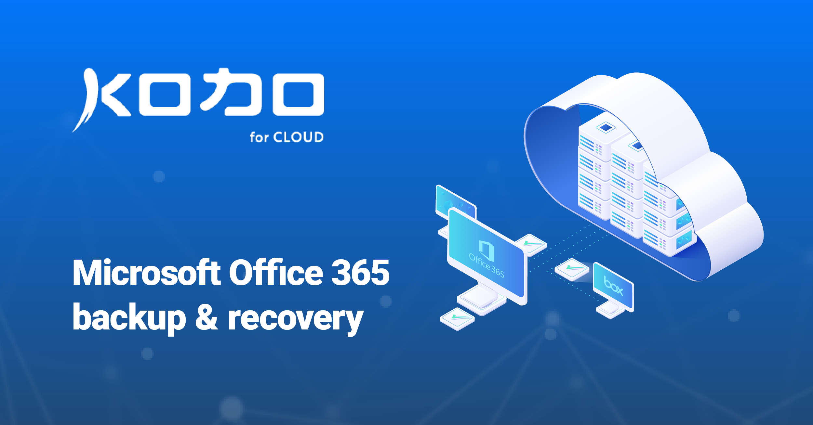

# KODO for Cloud documentation

This is the official documentation for KODO for Cloud software. Here you will find all the information needed to set up, configure and manage backup for your virtual and cloud infrastructure.

## About KODO for Cloud

KODO for Cloud \(Microsoft 365\) is a comprehensive solution that allows you to back up and restore data of your Microsoft 365 services like Exchange Online and  OneDrive for Business. It protects your business by performing daily backups to ensure business continuity and to meet compliance demands. KODO for Cloud protects your critical data from loss due to ransomware, malware, other threats, or just simple user errors.

Protecting your organization with KODO for Cloud is simple and effective. It provides granular data restoration and enables administrators to get the restore jobs done, reducing costs and meeting their SLA like RPOs and RTOs.

## Intended Audience

This guide is intended for IT specialists who want to provide 24/7/365 data protection and availability for Microsoft Office 365 users.

