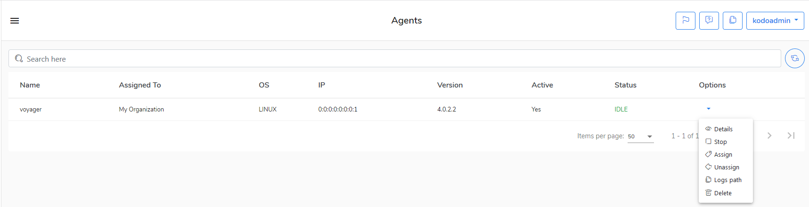

# Agents \(kodoadmin level\)

In this view you can verify currently configured cloud agent instances on the KODO for Cloud server.


Only one cloud agent instance is installed by default on The KODO for Cloud


## Management 

Log into server as `kodoadmin` user and go to the **Agents** view. In the **Options**  menu you can select one of the following options:

* **Details** - information about tasks that were handled by the agent  
* **Stop** - you can \(or start\) the agent's instance
* **Assign** - you can assign the agent to the defined organization
* **Unassign** - unassign agent from the organization
* **Logs path** - set the path for cloud agent logs
* **Delete** - choose the option to delete the agent



## Settings

If you need you can tweak some settings of the cloud agent. You have to log in to server using SSH protocol and go the directory `/opt/kodo-cloud/agent/instances/voyager/` 

You can edit some parameters in the `AgentConfig.json` file, whowever its not recommended if you are not asked about it by KODO support.     

```text
  "agent": {
    "name": "voyager",
    "concurrencySize": 5,
    "userAgent": "KODO/4.0",
    "logs": {
      "path": "../../logs/voyager",
      "level": "info",
      "console": true,
      "auditLog": false
    },
    "retries": 5,
    "saveFileToFileSystem": true,
    "jobs": {
      "concurrencySize": 25
    },
    "licensedUsers": true,
    "graphTimeout": 300
  },
  "server": {
    "address": "localhost.localdomain:8181",
    "ignoreCertificate": true
  }
}

```


