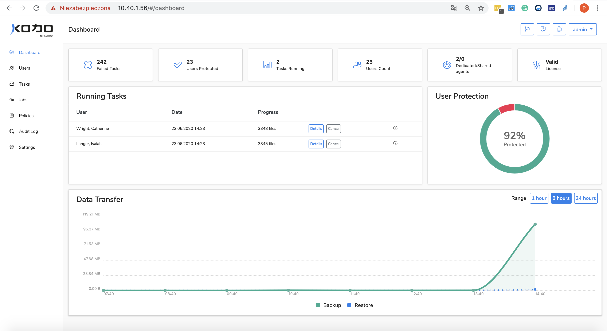
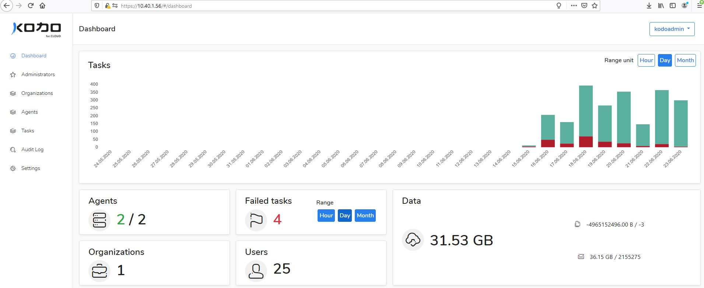

# Dashboard

After successful installation of **KODO for Cloud**, administrator can log into application using popular web browser \(e.g. Google Chrome, MozillaFirefox or MS IE Edge\). To do to this, use IP address of the server where "**KODO for Cloud**" server was installed. 

`https://KODO_server_IP_address`


Administrator can use either "admin" or "kodoadmin" account to log into application. 

The differences between both user types are described in the [Users ](https://app.gitbook.com/@storware/s/kodo-for-cloud-office365/~/drafts/-MAWwMuu2uq6CjweVK0b/administration/users)section. 


Administrator can log into console as "**admin**" user and then KODO for Cloud dashboard view appears as shown on the screenshot below. Using this dashboard administrator is able to manage his own organization and set up jobs to protect users data.

If administrator logs into console as "**kodoadmin**" user then different **KODO for Cloud** dashboard view appears as shown on the screenshot below.  Using this dashboard an administrator can add, delete, edit and manage server key components like organizations, agents and also change server settings. At this view all server key paramaters are visible for KODO administrator. 



