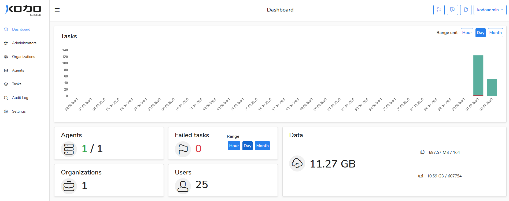

# Dashboard

After successful installation of **KODO for Cloud** server the administrator can log into the application using a popular web browser \(e.g. Google Chrome, Mozilla Firefox or MS IE Edge\). Type the IP address of the server where **KODO for Cloud** server was installed at the browser address bar. 

`https://KODO_server_IP_address`


The administrator can use admin or kodoadmin account to log into the application. 

The differences between both user types are described in the [Administration levels](../deployment/users.md) section. 


## The admin user dashboard

The administrator can log into the console as `admin` user and then KODO for Cloud dashboard view appears as shown on the screenshot below. Using this dashboard administrator is able to manage his own organization and set up jobs to protect users data.

At the dashboard view the following information is displayed:

* Failed Tasks
* User Protected
* Tasks Running
* Users Count
* Dedicated/Shared agents
* License status 
* Running Task
* User Protection
* Data Transfer

## The kodoadmin user dashboard

If the administrator logs into the  webUI console as `kodoadmin` user then a different **KODO for Cloud** dashboard view appears as shown on the screenshot below.  Using this dashboard  administrator can add, delete, edit and manage server key components such as organizations, agents and also change server settings. At this view, all server key parameters are visible for KODO administrator. 

