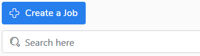
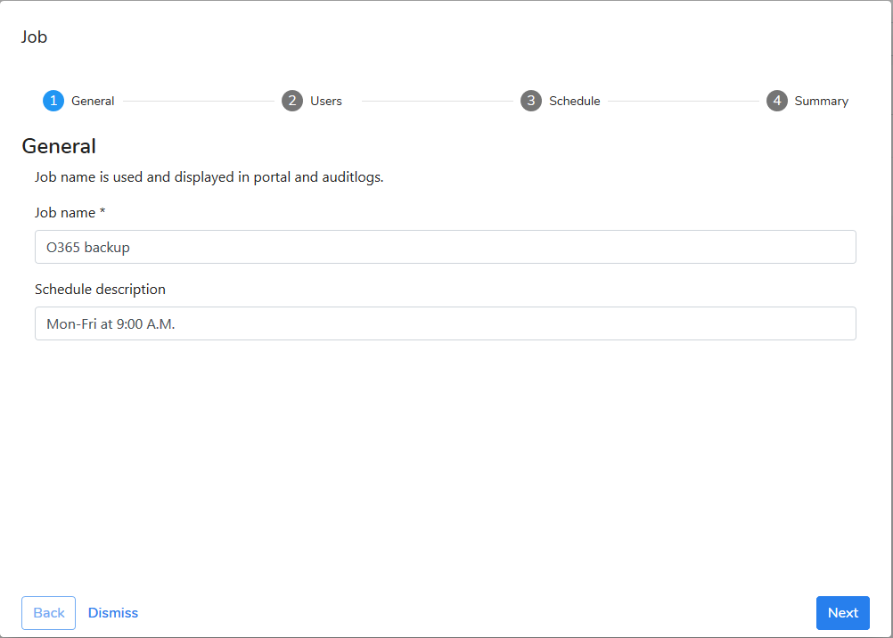
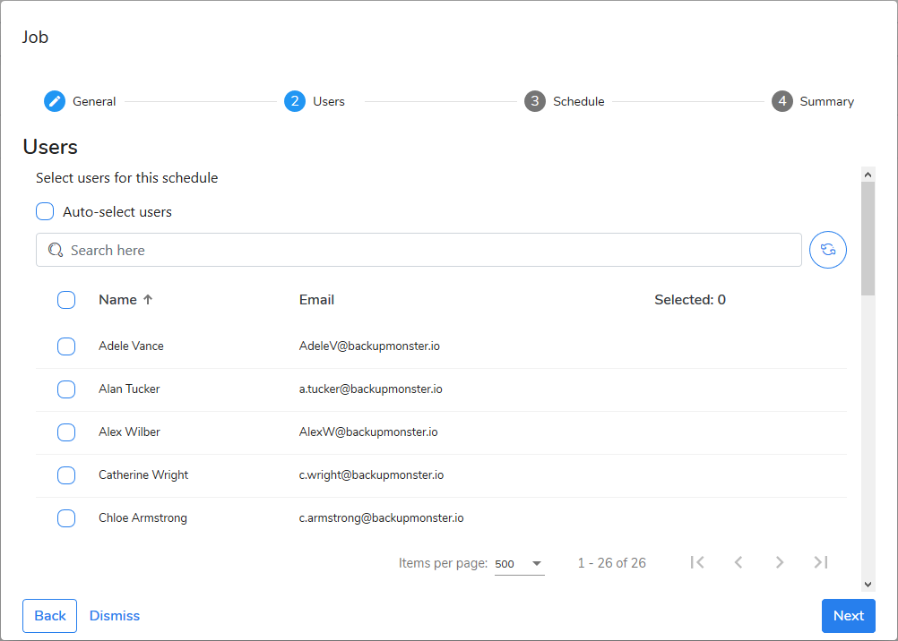
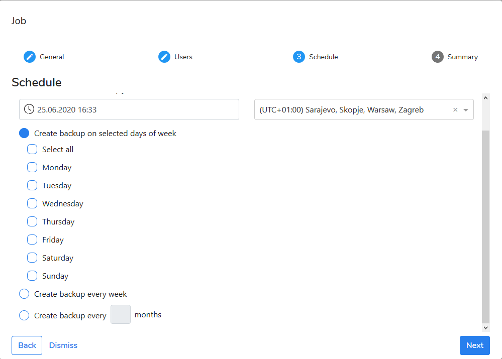

# Scheduled Backup

Follow instruction to create a new backup job:

1. Go to the **Jobs** view. 
2. Click **Create a Job** button.
3. Follow the steps of the wizard.

### Step: General

Enter a job name and schedule description and click **Next**.

### Step: Users

Select user that should be protected by this backup job. You can also use **Auto-select users** option to automatically protect all users registered in KODO from Office 365.  

### Step: Schedule

Create a schedule according to your internal backup policy.  Select when first full backup should start and the cycle in which it will be repeated \(incremental\). You can choose day\(s\) of week or other time interval \(week or month\).

### Step: Summary

Verify your job configuration and provide amendments if necessary. Save the job. The job is ready to work.

## What will happen next?

At the set, in job, time and date server will generate task for every selected user. Tasks will be waiting in queue to be processed by agent.

