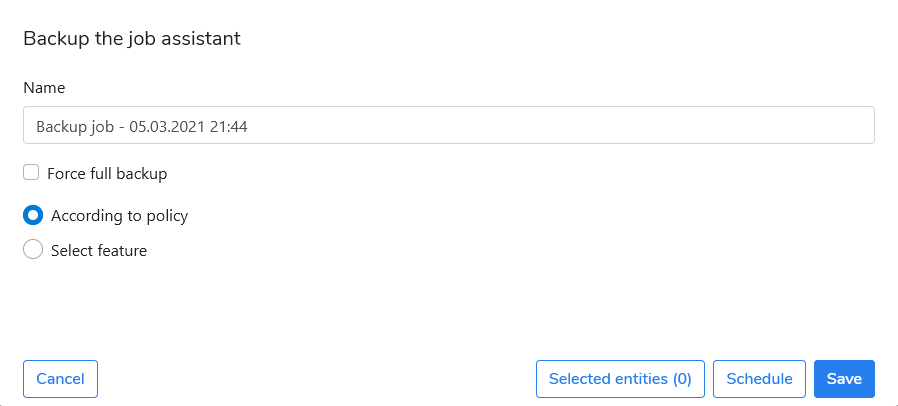
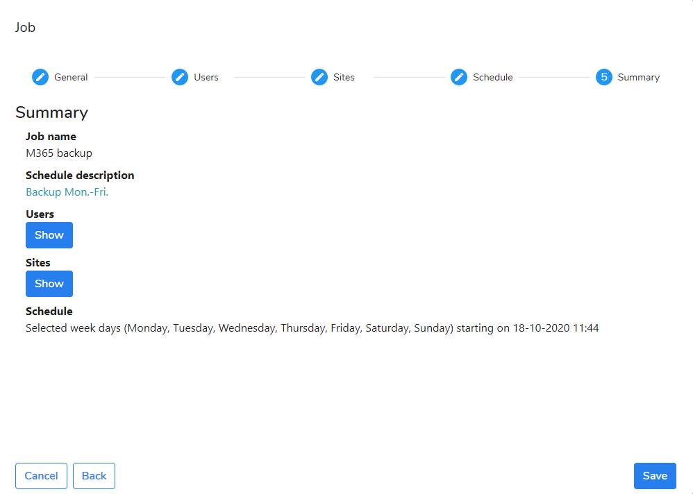

# Scheduled Backup

Follow the instruction to create a new backup job:

1. Go to the **Jobs** view. 
2. Click **Create a Job** button.
3. Follow the steps of the wizard to configure the job.

Enter a job name and select the following options:

* **Force full backup** - the backup will be executed with level "full"
* **According to policy** - Microsoft 365 features assigned to the policy will be included will in the backup tasks.
* **Select feature** - Microsoft 365 can be selected manually 

Click the **Selected entities** to include users and sites in the job. 

### Step 2: Users

Select a user or users that should be protected in this backup job. You can also use **Auto-select users** option to automatically protect all users registered in the defined Microsoft 365 organization.You can also use the search form to find a user by his name or email.

Click **Next** button to continue.

### Step 3: Sites

Select a site or sites that should be protected in this backup job. You can also use **Auto-select sites** to automatically protect all Sharepoint sites created in the defined Microsoft 365 organization. You can also use the search form to find a site by its name.

Click **Next** button to continue.

### Step 4: Schedule

Create a schedule according to your backup policy. Select the time when the first full backup should start and the cycle in which it will be repeated \(as incremental backup\). You can choose a day\(s\) of a week or other time interval \(week or month\). Set the time the job should be triggered.

### Step 5: Summary

Verify your job configuration and provide amendments if necessary. You can check the added users and sites to the job by clicking relevant **Show** button.  Save the job. Now the job is ready to start.

## What will happen next?

After creation, the task is set to the active state by default. When the time set in the task comes, the server will generate a task for each selected user. The tasks will wait in a queue to be processed by the cloud agent.

