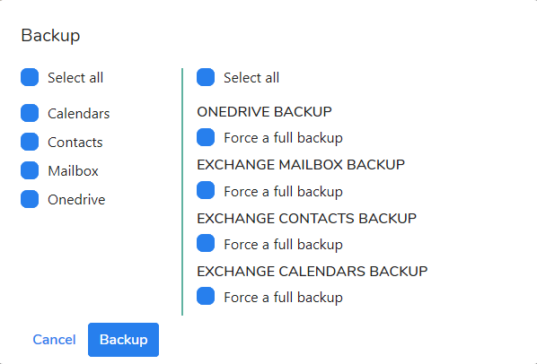
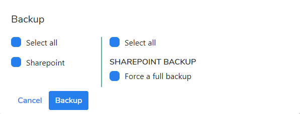

# On-Demand Backup

### Forcing full on-demand backup

If you want to perform full on-demand backup of Exchange Calendars, Contacts, Mailboxes, OneDrive files do the folllowing:

1. Go to the **Users** menu.
2. Select user or users you want to protect.
3. Click on **Backup** button.
4. Select components you want to protect or mark **Select all** radio button.
5. On the right side of the **Backup** window, mark **Select all** radio button to force the full on-demand backup.  

Click the **Backup** button to start the backup operation. The information as the one below should be displayed at the window. 

New task\(s\) will be generated and they will be waiting in the queue to be processed by agent\(s\).

If you want o perform full on-demand backup for SharePoint items do the following:

1. Go to the **Sites** menu.
2. Select a site or sites you want to protect.
3. Click on **Backup** button.
4. Select **Shaerpoint** component.
5. On the right side of the **Backup** window select **Sharepoint** to force the full on-demand backup.  

Click the **Backup** button to start the backup operation.

