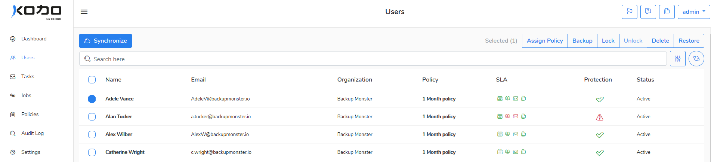
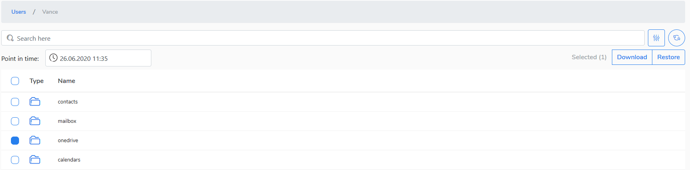
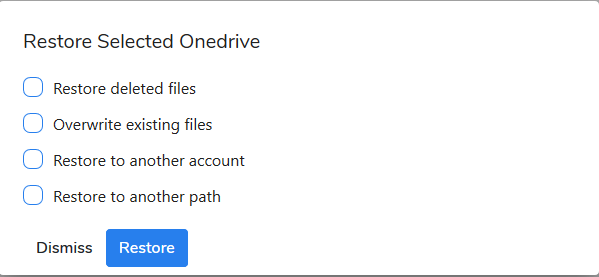

# Restore data to Microsoft 365

## Restore all user's data

To restore Microsoft 365 all user data do as follow:

1. Go to the **Users** view.
2. Select a  user whose data you want to restore by marking the radio button. Press the **Restore** button at the right-top window corner.

Confirm you want to recover data for the selected user. All user's Microsoft 365 data will be recovered. 

### Restore a selected user's data 

To browse and restore a selected item\(s\) from the user's backup do the following:

1. Go to the **Users** view.
2. Click a user whose data you want to browse and restore.
3. Click Microsoft 365 element \(e.g. OneDrive\) to browse it and recover selected item\(s\) or file\(s\).  

### Restore options

If you've selected a whole Microsoft 365 element and pressed **Restore** button then you have some recovery options to choose from. 

### Restore deleted files

Select this option if you want restore files that no longer exist at a source. 

### Overwrite existing files

Select this option if you want to overwrite existing items with a version from backup.

### Restore to another account

Select this option if you want to recover data to another user account.  If you choose this option you have yet two options:

* **Destination account mail** -select a user account you want to restore into.
* **Restore to another path** - select it if you need to recover data to another path.

Now you can confirm your action by simply clicking the **Restore** button. The restoration process will begin.      

