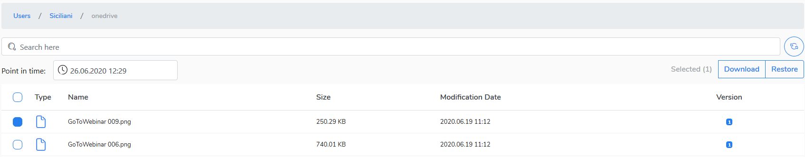

# Restoring data to local PC

To browse and restore backup data to your PC do the following:

1. Go to **Users** view.
2. Click a user whose data you want to browse and restore.
3. Seclect item\(s\) or files\(s\) you want to download.
4. Change the **Point in time** parameter if you want to recover previous version of item\(s\) or file\(s\).  

Click **Download** button in the right top corner. Confirm you want to download user data.


Data owner \(user\) will be notified by e-mail about downloaded item\(s\) or file\(s\).  Selected data will be downloaded in compressed format \(zip\).


In a few seconds the download of selected data will begin.

