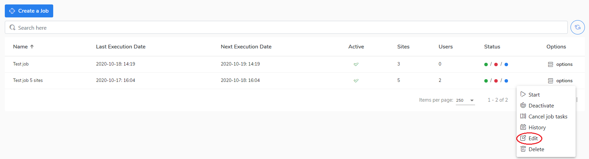

# Deactivate/activate a job

[NextDelete a job](https://app.gitbook.com/@storware/s/kodo-for-cloud-office365/~/drafts/-M_eTamUWMPAxlhoCgRb/administration/jobs/delete-a-job)If you don't want the job to be triggered you can deactivate it manually in the **Options** menu. 

If you want to do it, do as follow:

1. Go to the **Jobs** view.
2. Select a job and click on **Options.**
3. Choose the **Deactivate option** to deactivate the job.
4. The job is now deactivated and will not start automatically. 

If you want to activate the job, go to the **Options** menu and choose the **Activate** option.   

Go to the [Delete a job](delete-a-job.md) chapter to learn how to change the job configuration.

