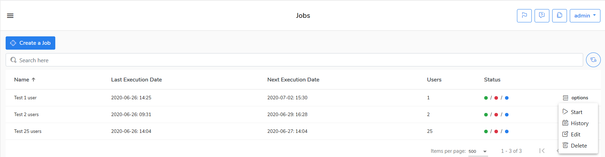

# Delete a job

If you want to delete a job, do the following steps

1. Go to the **Jobs** view.
2. Select a job and right mouse-click on **options.**
3. Choose **Delete** to delete the job.
4. Confirm if you want to do this operation.

