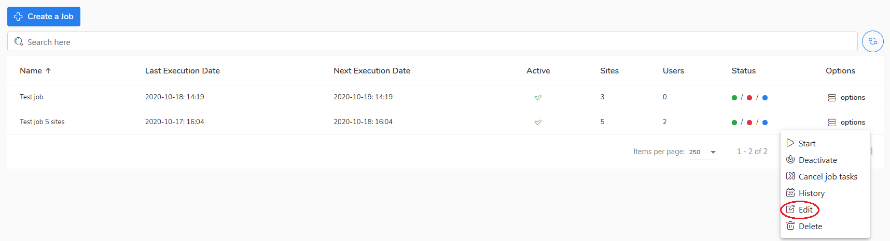

# Edit a job

If you want to edit a job, do the following:

1. Go to the **Jobs** view.
2. Select a job and right-click on **options.**
3. Choose the **Edit** to preview or configure the job.
4. The job configuration window will be opened. 
5. Now you can reconfigure the job.
6. Click the **Save** button to confirm amendments.      ****

Go to the[ Deactivate/activate a job ](deactivate-activate-a-job.md)chapter to learn how to change the job configuration.

