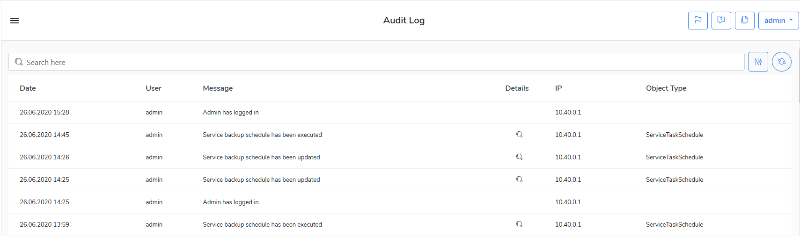

# Audit log

The administrator can review user\(s\) activity on the server by looking at the audit log. To browse the audit log go to the **Audit log** view.


You can search for messages for keyword\(s\) using the **Search here** bar.



You can search audit logs over a period of time using the calendar.


Go to the [Backup types]() chapter to learn about backup types supported by KODO for Cloud server.

