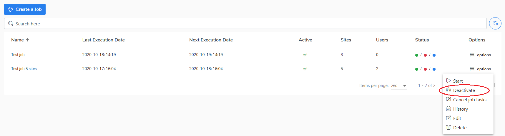

# Deactivate/activate a job

If you don't want the job to be triggered you can deactivate it manually in the **Options** menu.&#x20;

If you want to do it, do as follow:

1. Go to the **Jobs** view.
2. Select a job and click on **Options.**
3. Choose the **Deactivate option** to deactivate the job.
4. The job is now deactivated and will not start automatically.&#x20;

If you want to activate the job, go to the **Options** menu and choose the **Activate** option.  &#x20;

Go to the [Delete a job](https://storware.gitbook.io/kodo-for-cloud-office365/administration/kodo-organization-admin-guide/jobs/delete-a-job) section to learn how to change the job configuration.
