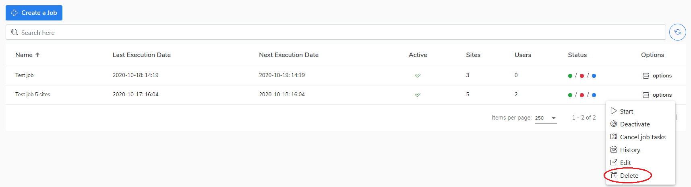

# Delete a job

If you want to delete a job, do the following steps

1. Go to the **Jobs** view.
2. Select a job and right-click on **options.**
3. Choose **Delete** to delete the job.
4. Confirm if you want to do this operation.

Go to the [Start a job \(manually\)](https://storware.gitbook.io/kodo-for-cloud-office365/administration/kodo-organization-admin-guide/jobs/start-a-job-manually) chapter to learn how to start the job manually.

