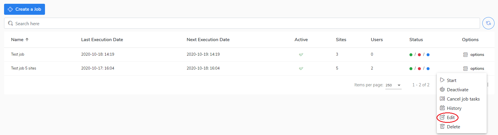

# Edit a job

If you want to edit a job, do the following:

1. Go to the **Jobs** view.
2. Select a job and right-click on the **Options.**
3. Choose the **Edit** to preview or configure the job.
4. The job configuration window will be opened.&#x20;
5. Now you can reconfigure the job.
6. Click the **Save** button to confirm amendments.     &#x20;

Go to the[ Deactivate/activate a job ](https://storware.gitbook.io/kodo-for-cloud-office365/administration/kodo-organization-admin-guide/jobs/deactivate-activate-a-job)section to learn how to change the job configuration.
