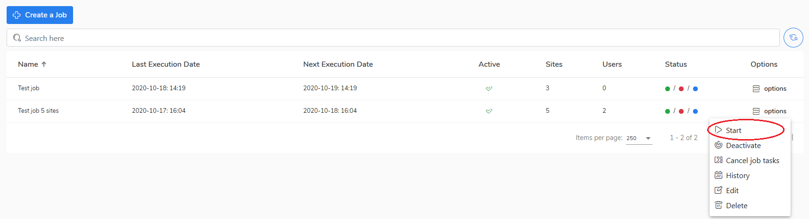

# Start a job \(manually\)

If you want to start a job manually, do the following:

1. Go to the **Jobs** view.
2. Select a job and click on **Options.**
3. Choose **Start** to start the job.
4. Confirm you want to start the job. 
5. Now you can monitor the job progress in the [Tasks ](https://storware.gitbook.io/kodo-for-cloud-office365/administration/kodo-organization-admin-guide/tasks)view.   

Go to the [Policies](https://storware.gitbook.io/kodo-for-cloud-office365/administration/kodo-organization-admin-guide/policies) chapter to learn how to change the job configuration.

