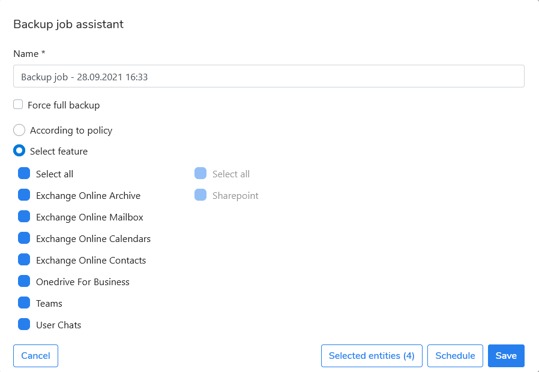

# Scheduled Backup

1. Go to the **Protection** menu.
2. Switching between tabs, select entities to protect (User, Sites, Teams), and click the **Backup** button.
3. In the **Backup job assistant** window, select the **According to policy** option or select **Select a feature** to choose features to protect.
4. Click on the **Schedule** button and schedule backup execution.
5. Click on the **Save** button.

.png>)

The backup for selected entities will be executed accordingly to the set schedule and the backup job is now displayed on the list in the Jobs menu. Now you can monitor the backup progress in the Tasks menu. Once the backup job is finished, you can do the data [recovery](https://storware.gitbook.io/kodo-for-cloud-office365/administration/kodo-organization-admin-guide/protection/restore).
