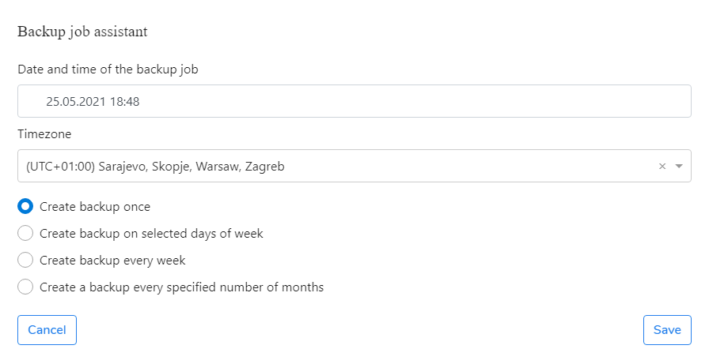

# Scheduled Backup

1. Go to the **Protection** menu.
2. Select a user or users you want to protect and click the **Backup** button.
3. In the **Backup job assistant** window, select the **According to policy** option or select **Select a feature** to choose from available features.
4. Click on the **Schedule** button and schedule backup execution
5. Click on the **Save** button.

The backup for selected users is running and the backup job was created under the Jobs menu. Now you can monitor the backup progress in the Tasks menu. Once the backup job is finished, you can do the data [recovery](https://storware.gitbook.io/kodo-for-cloud-office365/administration/kodo-organization-admin-guide/protection/restore).

