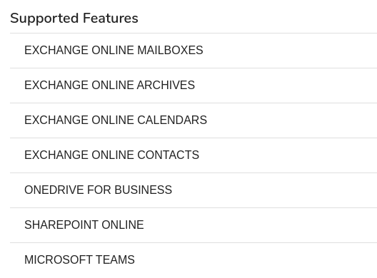

# Global

In this tab, you can verify your server/agent version and available service options.

In the **Global** tab you can also set the following KODO server parameters:

**Cleaning** - set time period for tasks and audit log retentions \(in days\).

**Synchronization settings** - mark the option **Automatically synchronize accounts** and set time. All newly created accounts will be added to the KODO for Cloud server. You can also set your time zone accordingly.

**Usage & activity report** - enter parameters to send usage and activity report.

