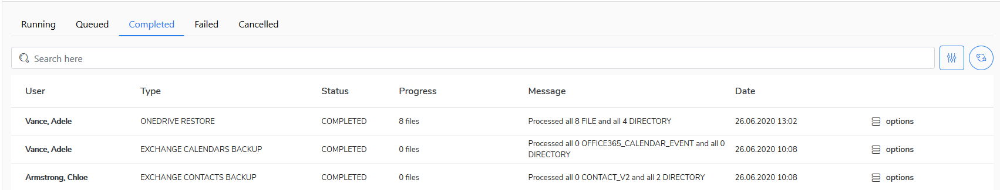
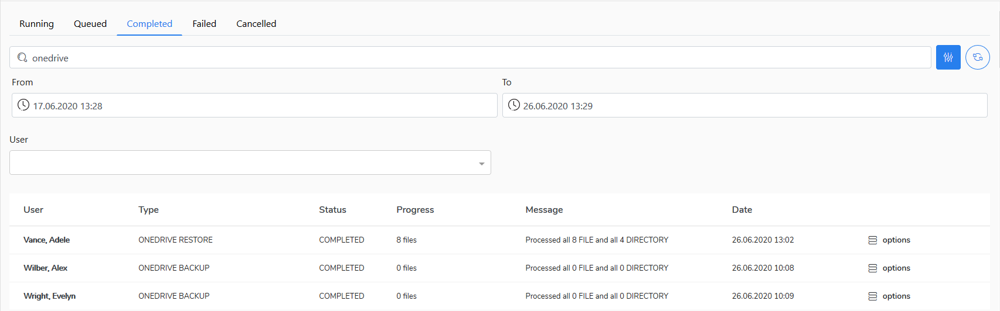

# Tasks

All system tasks that have been, will be or are being performed on the **KODO for Cloud** server are collected in the **Tasks** view.&#x20;

The tasks are divided into the following categories:

* Running
* Queued
* Completed
* Failed
* Canceled

There are several task types:

* Backup
* Restore
* Import
* Verification
* Download
* Retention

You can search tasks by task type (e.g. OneDrive Backup), over a period of time (by calendar), or by user name. To do this, click the filter icon at the right-top window corner.

Go to the [Jobs](https://storware.gitbook.io/kodo-for-cloud-office365/administration/kodo-organization-admin-guide/jobs) chapter to learn about the Jobs menu.
