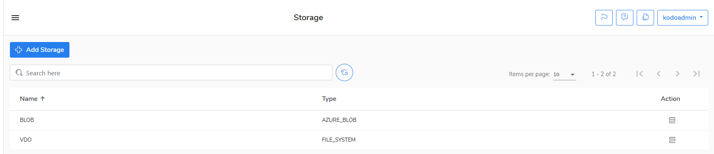

# Storage

To configure storage on KODO for Cloud server, go to the **Storage** menu. Click the **Add Storage** button to configure a destination location for backup. You can define storage out of two available storage types: FILE SYSTEM or AZURE BLOB.

If you select the **FILE SYSTEM** as the storage type, you have to assign a name to and enter a valid storage path \(it can be a path of a regular filesystem or a VDO device\).

If you select the **AZURE BLOB** as the storage type, you have to assign a name to and enter at least the **Account Name** and **Account Key**. You can enter the **Endpoint Suffix** and the **Container** optionally. 

There's no limit on the number of created storage configurations.

Go to the [Settings](https://storware.gitbook.io/kodo-for-cloud-office365/administration/kodoadmin-user-guide/settings) chapter to learn about how to define other settings of KODO for Cloud server.

