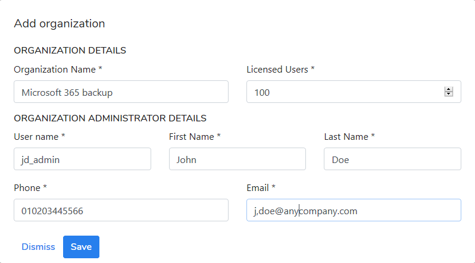

# Organizations \(kodoadmin dashboard only\)

There is only one default organization \(My Organization\) after KODO for Cloud server installation is completed. You can disable, edit or delete the default organization by selecting one of the options for **options** menu.

 

You can add another organization by clicking the **Add Organization** button. You have to provide some information about defining organization  

