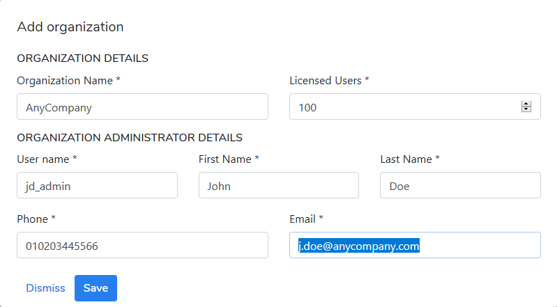

# Organizations \(kodoadmin level\)

There is only one default organization \(My Organization\) after KODO for Cloud server installation is completed. You can disable, edit, or delete the default organization by selecting one of the options from **options** menu.

You can add another organization\(s\) by clicking the **Add organization** button. You have to provide the required information about the organization you are adding. Enter the following information:

* Organization name
* Licensed Users
* User name
* First name
* Last name
* Phone
* Email

Once the organization is created, the information with account access is sent to the provided email address recipient.

