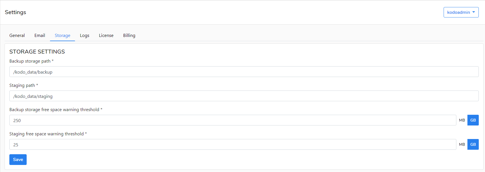
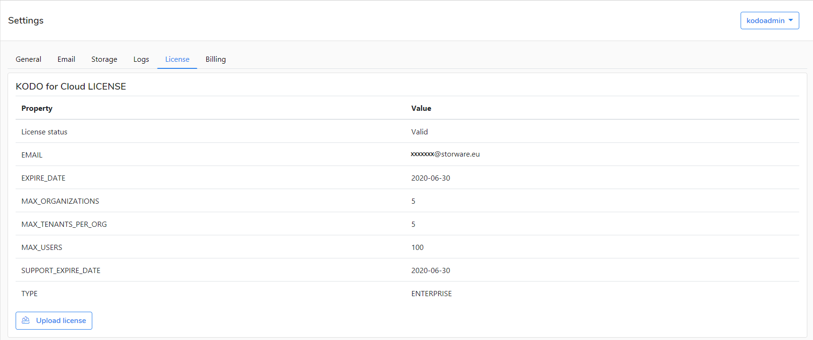
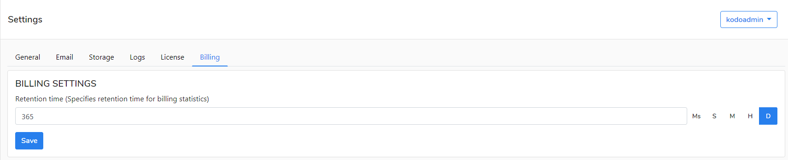

# KODO Admin

The **kodoadmin** user is a predefined administrative user on KODO for Cloud server.  If you are logging in to the  server as `kodoadmin` then you can edit the server settings in the tabs.

## General tab

Here you can edit the following settings:

* **General settings**- allowed IP addresses to login with KodoAdmin role
* **Support website URL** -the address of KODO support website.
* **Product website URL**- the address of Storware support website.
* **Documentation website URL** - the address of KODO documentation website.

## Email tab

You have to add the email settings for KODO server to be able to send notification. You have to add the following settings:

* **E-mail address** - the email address of the sender
* **Login** - usually it's the same as the email address 
* **Server address -** SMTP server IP name or address \(for Microsoft 365 service the server name is smtp.office365.com\), but you can use any other SMTP server.
* **Port** -usually it's 25 or 587
* **use SSL** - mark it if you want to use SSL protocol
* **Password -** the password for the user provided in the  "Login" form 

## Storage tab

Here you can edit the following settings:

* Backup storage path
* Staging path
* Backup storage free space warning threshold
* Staging storage free space warning threshold

## Logs tab

Here you can edit the following settings:

* Maximum number of files 
* Log level
* Max file size

You can also download Server logs or Application Logs for troubleshooting or to send this information to KODO support.

## License tab

Here you can preview the current license or update a new one.

## Billing tab

Here you can edit your billing settings. This information is used by kodoadmin to charge all defined organizations in Kodo for Cloud server.

