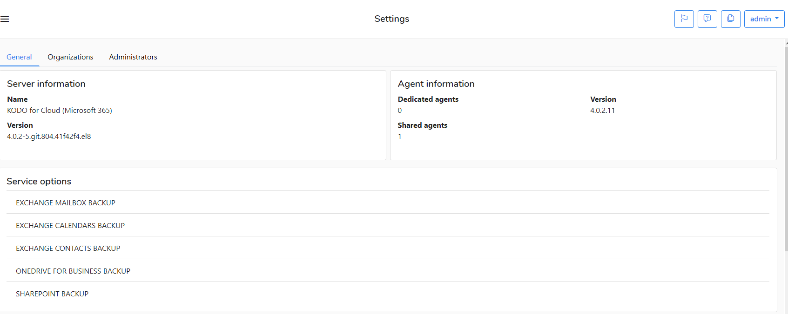

# Organization Admin

The **admin** user is a predefined administrative organization user on KODO for Cloud server.  If you are logging in to the  server as `admin` then you can edit the organization settings in the tabs.

## General tab

In this tab, you can verify your server/agent version and available service options. 

In the Setting window you can also set the following KODO server parameters:

**Cleaning** - set time period for tasks and audit log retentions \(in days\).

**Synchronization settings** - mark the option **Automatically synchronize accounts** and set time. All new created accounts will be added to the KODO for Cloud server. You can also set your timezone.

**Usage & activity report** - enter parameters to send usage and activity report.

## Organizations tab

In this tab you can add, edit or delete the organization. 

## Administrators tab

In this tab you can add, edit, set password or delete the administrator. Newly added administrator will have the right to administer all defined organizations under **Organization** tab.

To add new organization administrator do the following:

1. Click **Add administrator** menu.
2. Enter the administrator **username**.
3. Enter **First name**.
4. Enter **Last name**.
5. Enter **Email** address.
6. Enter **Phone number**.  

In the next step you have to set a password for defined organization administrator:

