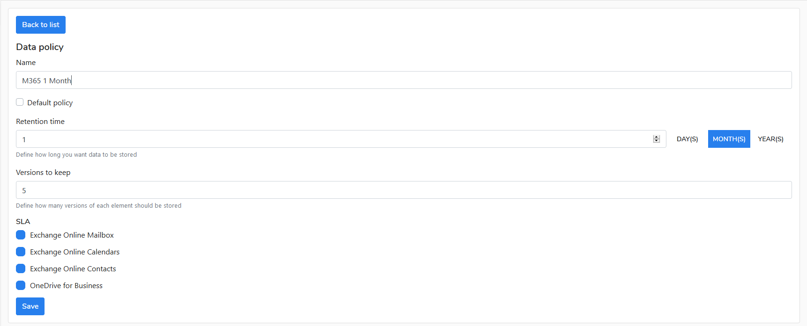

# Create a policy

To create a data policy do the following:

1. Go to **Policies** view
2. Click on **Add Policy** button
3. Configure the data policy due to your company backup regulations and confirm settings by pressing **Save** button. 

 

