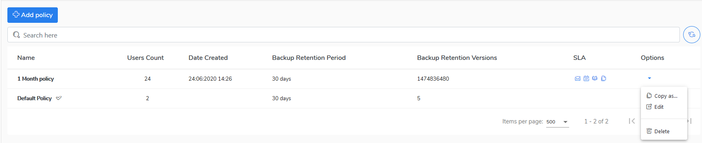

# Edit a policy

If you want to edit a data policy, do the following steps:

1. Go to the **Policies** view.
2. Do the right mouse-click on **Options** on the right side.
3. Choose **Edit** to preview or configure the policy.
4. The policy configuration window will be opened. 
5. Now you can reconfigure the policy.
6. Click **Save** button to confirm amendments.  

