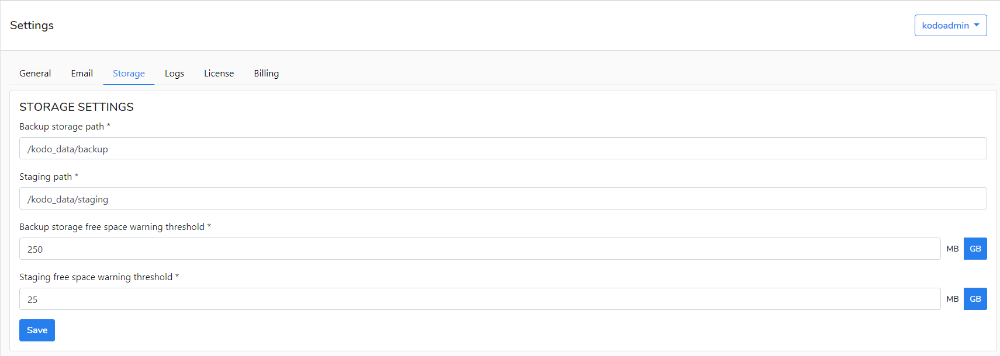
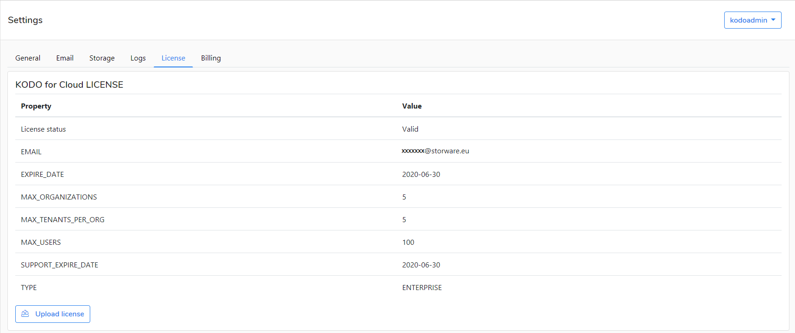

# KODO Admin

The **kodoadmin** user is a predefined administrative user on KODO for Cloud server.  If you are logging in to the  server as `kodoadmin` then you can edit the server settings in the tabs.

## General

Here you can edit the following settings:

* General settings-- allowed IP addresses to login with KodoAdmin role
* Support website URL -the addess of KODO support website.
* Product website URL- the addess of Storware support website.
* Documentation website URL - the addess of KODO documentation  website.

## Email

Here you can edit the following settings:

* E-mail address
* Login
* Server address
* Port
* SSL port \(if used\)
* Require Authentication
  * Password

## Storage

Here you can edit the following settings:

* Backup storage path
* Staging path
* Backup storage free space warning threshold
* Staging storage free space warning threshhold

## Logs

Here you can edit the following settings:

* Maximum number of files 
* Log level
* Max file size

You can also download Server logs or Application Logs for troubleshhoting or to send this information to KODO support.

## License tab

Here you can preview current license or update a new one.

## Billing

Here you can edit your billing settings.

