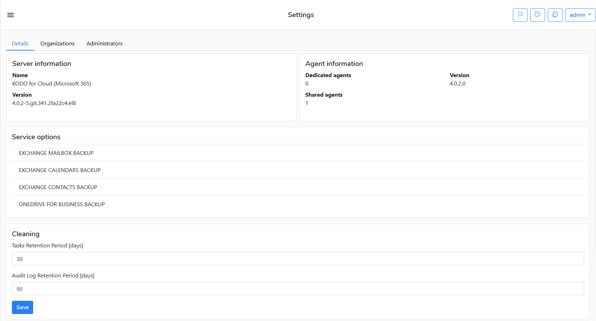
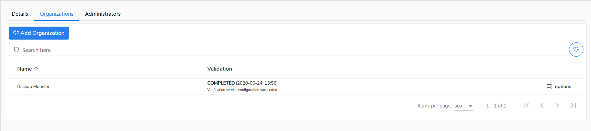

# Organization Admin

The **admin** user is a predefined administrative organization user on KODO for Cloud server.  If you are logging in to the  server as `admin` then you can edit the organization settings in the tabs.

## Details tab

In this tab you can verify you server/agent version and available service options. 

You can also alter the retention period for tasks and audit log.

## Organizations tab

In this tab you can add, edit or delete an organization.

## Administrators tab

In this tab you can add, edit, set password or delete an administrator. Newly added administaror will have right to administer all definiden arganizations under **Organization** tab.

