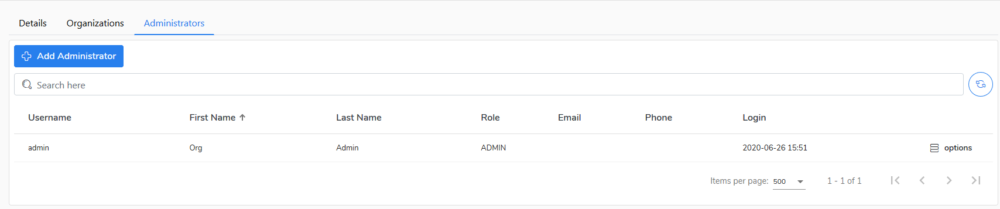

# Organization Admin

## Details

In this tab you can verify you server/agent version and available service options. 

You can also alter the retention period for tasks and audit log.

## Organizations

In this tab you can add, edit or delete an organization.

## Administrators

In this tab you can add, edit, set password or delete an administrator. Newly added administaror will have right to administer all definiden arganizations under **Organization** tab.

