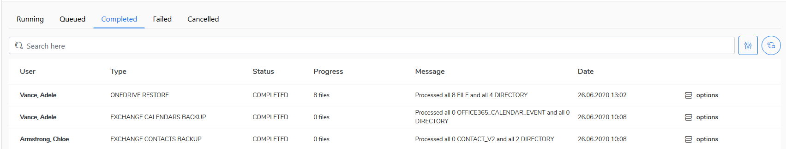
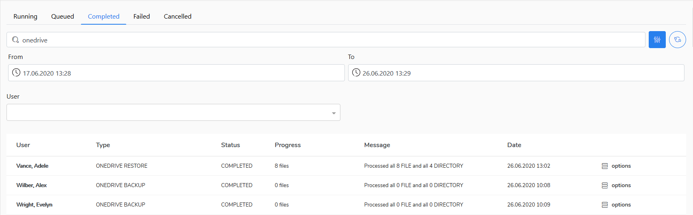

# Tasks

In the **Tasks** view, there are collected all system tasks that have been, will be or are being performed on the **KODO for Cloud** server. 

Tasks are divided into the following categories:

* Running
* Queued
* Completed
* Failed
* Cancelled

There are several task types:

* Backup
* Restore
* Import
* Verification

You can search tasks by a task type \(e.g. OneDrive Backup\), over a given period \(by calendar\) or by user name. To do this, click the filter icon at the right top corner.

