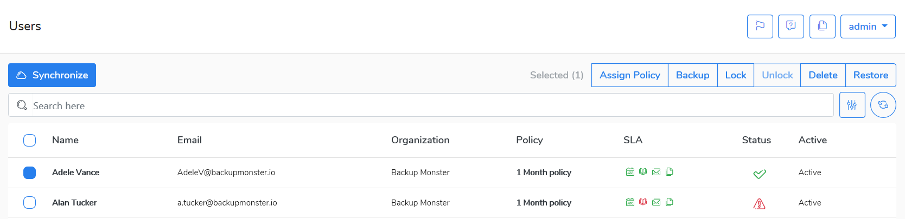

# Users

In this view, you can see all users synchronized \(imported\) from a defined organization \(Microsoft 365\)

Click **Synchronize** button to import users from Microsoft 365 organization.

You can do the following activities on the user\(s\):

* Assign [Policy](policies/)- change a data policy  for assigned user\(s\)  
* [Backup](data-backup/on-demand-backup.md)- start a backup process for selected user\(s\)
* Lock/Unlock -lock/unlock user\(s\)
* Delete -delete selected user\(s\)
* [Restore](data-restore/restore-data-to-microsoft-365.md)-restore users\(s\) data

