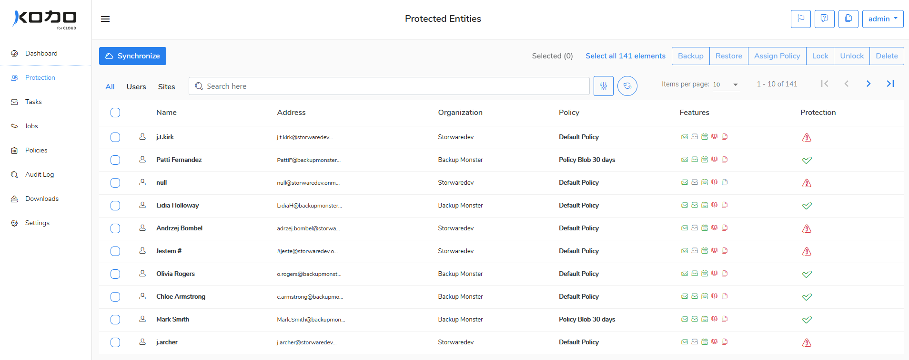

# Protection

In this view, you can see all users and Sharepoint sites synchronized \(imported\) from the defined organization \(Microsoft 365\)

Click **Synchronize** button to import users or sites from Microsoft 365 organization. Switch to the **Users** view to synchronize users only or switch to the **Sites** view to execute the same action to the Sharepoint sites. 

You can do the following activities on the protected entities \(users or sites\):

* Assign [Policy](policies/)- to change a data policy  for the assigned entities
* [Backup](data-backup/on-demand-backup.md)- to start a backup process for the selected entities
* Lock/Unlock -to lock/unlock entities
* Delete -to delete selected entities
* [Restore](data-restore/restore-data-to-microsoft-365.md)- to store entities data


If an entity is deleted from the server, his status is automatically changed to "**Locked**". The deletion process is running in the background on the server and the backups are removed from the backup storage. When the process is finished, the entity is also removed from the list but not from the Microsoft 365 service. If the entity is preserved in the Microsoft 365 service, the organization admin can synchronize his account with KODO for Cloud server and add it to any defined policy.  


