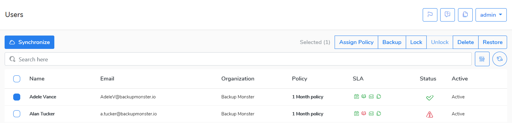

# User management

You can do the following activities on user\(s\):

* Assign [Policy](../policies/)- change assigned user\(s\) data policy 
* [Backup](../data-backup/on-demand-backup.md)- backup user\(s\)
* Lock/Unlock -lock/unlock user\(s\)
* Delete -delete user\(s\)
* [Restore](../data-restore/restore-data-to-microsoft-365.md)-restore users \(s\)

