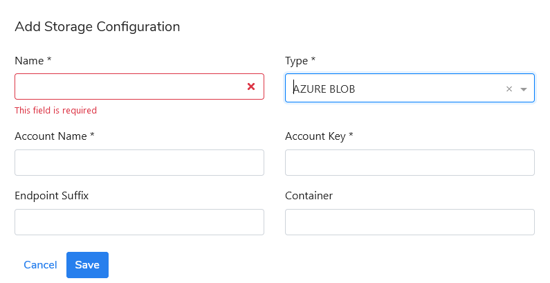

# Define a storage type for a backup destination

Log into the Kodoadmin dashboard as `kodadmin`  and go to the Storage menu. 

Click the **Add Storage** button to configure a destination location for backup. You can define storage out of two available storage types: FILE SYSTEM or AZURE BLOB.

If you select the **FILE SYSTEM** as the storage type, you have to assign a name to and enter a valid storage path \(it can be a path of a regular filesystem or a VDO device\).

If you select the **AZURE BLOB** as the storage type, you have to assign a name to and enter at least the **Account Name** and **Account Key**. You can enter the **Endpoint Suffix** and the **Container** optionally. 

There's no limit on the number of created storage configurations.

Now you can go to the next step and configure the **Agent config.**

\*\*\*\*

