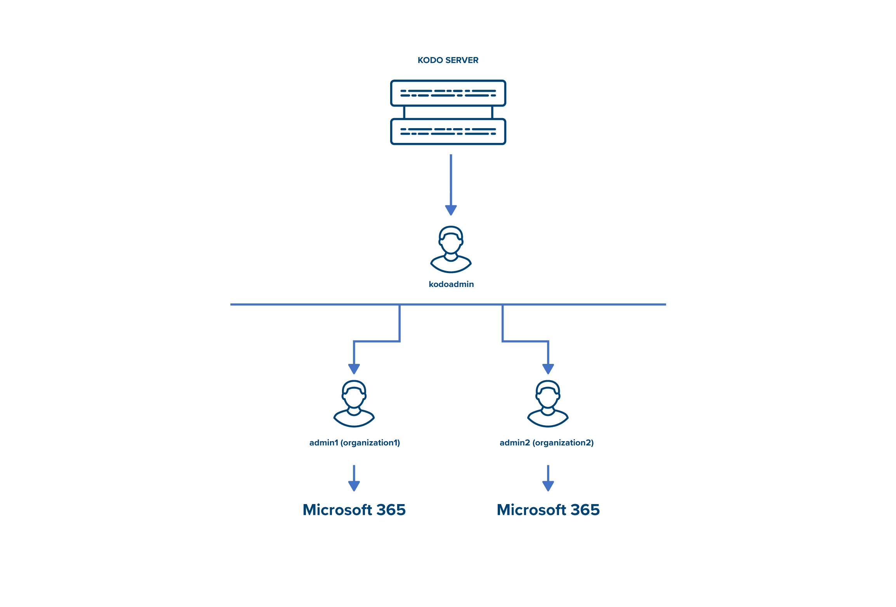

# Kodoadmin vs KODO organization admin

KODO for Cloud server was designed in a multi-tenancy architecture. It means that you can define multiple instances of organizations. Within each organization, you can define more than one Microsoft 365 organization.

 KODO for Cloud server has two predefined administration access levels: 

* **KODO administration level** - the administrator's level to configure and manage KODO for Cloud server. It is accessed through UI as logging in as predefined`kodoadmin` user. The kodoadmin user will be called "global admin" for the purpose of this documentation. 
* **KODO organization administration level** - the organization administrator's level to configure and manage defined KODO organization on KODO for Cloud server. It is accessed through UI by logging in as predefined`admin` ****user. The admin user will be called "organization admin" for the purpose of this documentation. 

### Default login credentials


Here are credentials for two predefined administrator accounts:

* default global admin: `kodoadmin`with password`Kodo@dm1n` 
* default organization admin: `admin`with password`Kodo@dm1n`


First, you have to log in to the server as `kodoadmin` user and add KODO license to enable the full functionality of the server.

Go to the[ License ](https://storware.gitbook.io/kodo-for-cloud-office365/deployment/initial-configuration/license)section to learn how to add a license  KODO for Cloud server.

