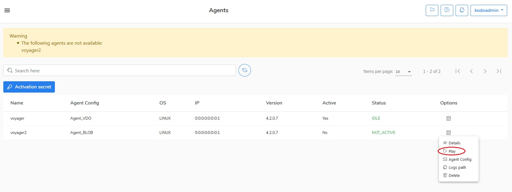

# Launching the cloud agent

After the license is added, you have to go to the Agents menu and launch the cloud agent.  In the Agents window should be a warning displayed: "**The following agents are not available: agent\_name**". The default name for the KODO cloud agent is "**voyager**".

To launch the agent go to the **Options** menu and click the **Play** button.

Now the activity status in the "**Active**" column should be changed from "**No**" to "**Yes**". 

