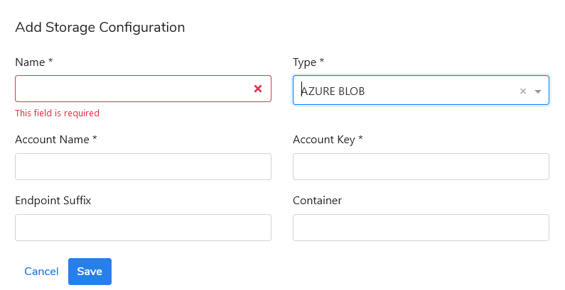
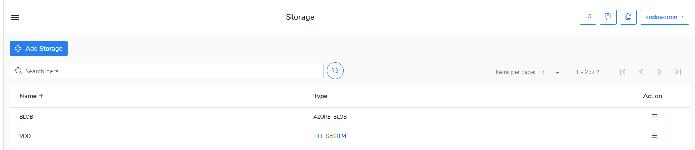

# Define storage type for backup

Log into the Kodoadmin dashboard as `kodadmin`  and go to the Storage menu. 

Click the "**Add Storage**" button to configure a destination location for backup. You can define storage from two available types: FILE SYSTEM or AZURE BLOB.

If you select "**FILE SYSTEM**" as the storage type, you have to assign a name to and enter a valid storage path.

If you select "**AZURE BLOB**" as the storage type, you have to assign a name to and enter at least the "**Account Name**" and "**Account Key**". You can enter the "**Endpoint Suffix**" and the "**Container**" optionally. 

There's no limit on the number of created storage definitions.

Now you can go to the next step and configure the **Agent config.**

\*\*\*\*

