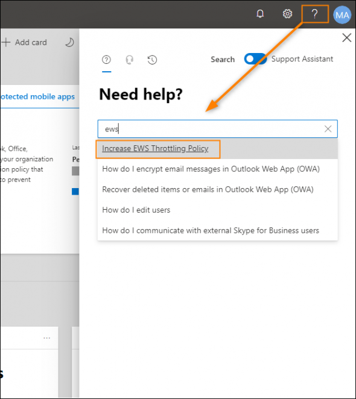
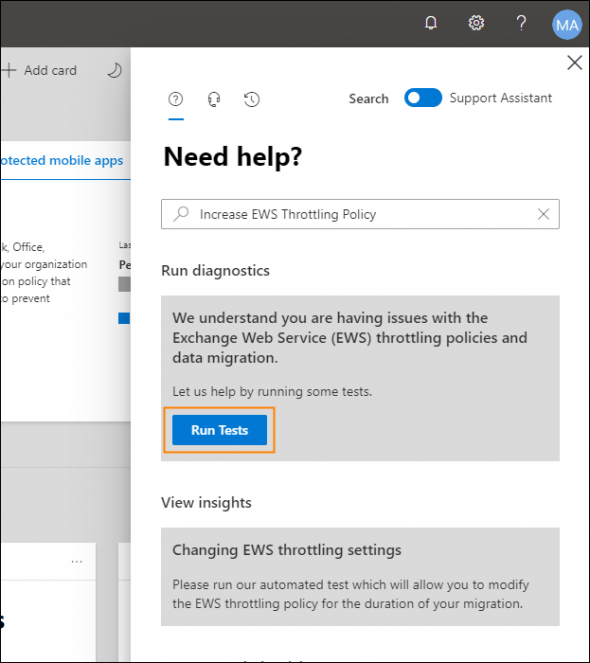
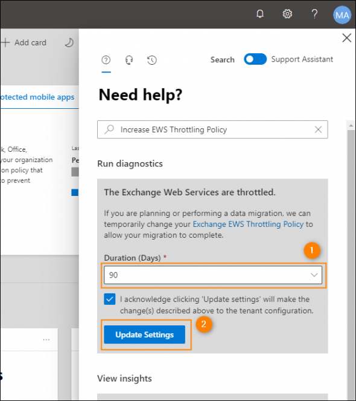

# Increase the EWS throttling policy limits in Exchange Online \(Microsoft 365\)

Normally, it is not possible to modify throttling policies on your own in Exchange Online. Originally, this was possible via the PowerShell remote connection, but throttling-related cmdlets have been removed from Exchange Online PowerShell some time ago. However, it is still possible to temporarily ease EWS throttling either by using the automated help pages in Microsoft 365 admin center or through Microsoft support. 


The option to change EWS throttling settings through the automated help pages has been introduced as a response to the COVID-19 crisis. It is possible that this option may become unavailable over time.


Perform the steps below to temporarily increase EWS throttling policy in Exchange Online by yourself:

1. Sign in to your [Microsoft 365 admin center](https://admin.microsoft.com/?source=applauncher).
2. Click the "**?"** \(**Help**\) icon in the upper-right corner of the page. If the switch at the upper part of the Help pane is pointing to **Support Assistant**, change it to **Search**.
3. In the search field, enter **ews** and select **Increase EWS Throttling Policy** from the lists of query suggestions.

4.  You will be asked to diagnose throttling settings for your tenant. Click **Run Tests** to do so.

5.  If the Exchange Web Service is throttled, you will have the option to ease the throttling policy settings for **30**, **60** or **90** days. Select the value that meets your needs from the **Duration \(Days\)** drop-down menu and click **Update Settings.**

The changes should take effect within 15 minutes.

