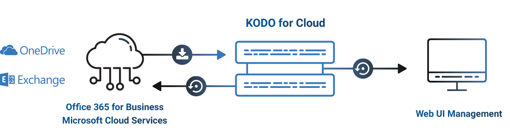

# Architecture

## High-level Architecture

Use KODO for Cloud to back up and restore your data from your Microsoft 365. You can back up data to and recover data from local filesystem, Virtual Data Optimizer \(VDO\) or NFS/CIFS share. 

## Detailed Architecture

### KODO Cloud agent \(backup agent\)

This server component does the following:

* It retrieves Microsoft 365 items from the cloud and stores it locally \(on local disk or NFS share\)
* During restore process it sends data back to the cloud or data is recovered locally. 


KODO Cloud agent can be multiplied for better backup/restore performance


### KODO Cloud Server \(API-core\)

* Management + orchestration

### KODO DB \(MariaDB\) 

* Internal KODO database \(backup catalog\) for keeping all metadata for protected users. 

### Backup Storage

* It's a place where KODO for Cloud stores backup data.

## Component placement

* KODO for Cloud server and agent isinstalled in the same system by default. 
* Server can be installed on a physical or a virtual machine.
* Agent may be installed during KODO for Cloud server installation \(see the chapter  [Quick Install \(All-In-One\)](../deployment/quick-install-all-in-one.md)\) .
* Both components are installed on the CentOS/RHEL 8 minimal.

