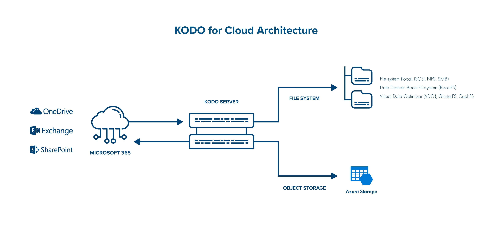

# Architecture

## High-level Architecture

Use KODO for Cloud to back up and restore your data from your Microsoft 365. You can back up data to and recover data from the local filesystem, Virtual Data Optimizer \(VDO\), Azure Blog Storage, Gluster FS, CephFS or NFS/CIFS share. You can store your data on DataDomain deduplicator using DD boostfs protocol.

## Detailed Architecture

KODO for Cloud consists of 2 main components:

* **KODO server** - central point of management, provides administrative Web UI, APIs and is a central repository of metadata.
* **KODO cloud agent** - data mover that performs backups and restores :
  * you can have multiple nodes,
  * all nodes are managed by the server and need to be registered to the server.

### KODO Cloud agent \(backup agent\)

This server component does the following:

* It retrieves Microsoft 365 items from the cloud and stores them locally \(on local disk or NFS share\)
* During the restore process, it sends data back to Microsoft 365 service, or data can be recovered locally. 


KODO Cloud agent can be multiplied for better backup/restore performance


### KODO Cloud Server \(API-core\)

* The central point of KODO server management, provides administrative Web UI, APIs and is also the central repository for metadata.

### KODO DB \(MariaDB\) 

* Internal KODO database \(backup catalog\) for keeping all metadata for protected users' data. 

### Backup Storage

* It's a place where KODO for Cloud server stores backup data.

## Component placement

* KODO for Cloud server and agent is installed on the same system by default. 
* The server can be installed on a physical or a virtual machine.
* The agent may be installed during KODO for Cloud server installation \(see the chapter  [Quick Install \(All-In-One\)](../deployment/quick-install-all-in-one.md)\).
* Both components are installed on the CentOS/RHEL 8 minimal.

