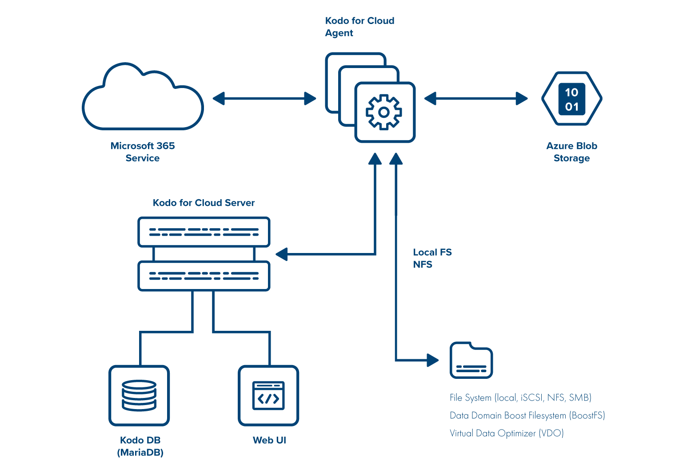

# Architecture

## High-level architecture

Use KODO for Cloud to back up and restore your data from your Microsoft 365. You can back up data to and recover data from the backup storage like:&#x20;

* File system Storage,&#x20;
* Data Domain deduplication appliance.
* Virtual Data Optimizer (VDO),&#x20;
* Azure Blog Storage,&#x20;
* NFS/SMB share&#x20;

.png>)

## Detailed architecture

KODO for Cloud consists of 2 main components:

* **KODO for Cloud Server(API-core)** - the central point of management, provides administrative Web UI, APIs and is a central repository of metadata.
* **KODO for Cloud Agent** - data mover that performs backups and restores:
  * it retrieves Microsoft 365 items from the cloud and stores them locally (on local disk, NFS share, or Azure Blob Storage)
  * during the restore process, it sends data back to Microsoft 365 service, or data can be recovered locally
  * cloud agent can be multiplied for better backup/restore performance

## Component placement

* KODO for Cloud server and cloud agents can be installed on the same system.&#x20;
* The server can be installed on a physical or a virtual machine.
* The agent can be installed on a separate system if needed.
* The agent may be installed during KODO for Cloud server installation (see the chapter [Quick Install (All-In-One)](https://storware.gitbook.io/kodo-for-cloud-office365/deployment/installation-overview/quick-install-all-in-one)).
* Both components are installed on the CentOS/RHEL 8 minimal.

On KODO for Cloud server the following components are also configured:

#### KODO database (MariaDB)&#x20;

* KODO database (backup catalog) for keeping all metadata of protected users' data is configured in MariaDB.&#x20;

#### Backup Storage

* It's a storage destination where KODO for Cloud server stores backup data.

Go to the [Support Matrix](https://storware.gitbook.io/kodo-for-cloud-office365/overview/support-matrix) serction to learn about what features and functions KODO for Cloud server supports.
