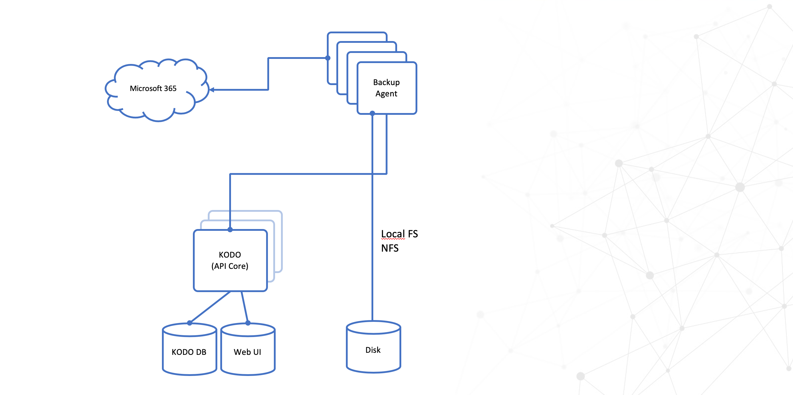

# Architecture

## High-level Architecture

Use KODO for Cloud to back up and restore your data from your Microsoft 365. You can back up data to and recover data from local filesystem, Virtual Data Optimizer \(VDO\) or NFS/CIFS share. 


## Detailed Architecture



### KODO Cloud agent \(Backup Agent\)


* Retrieves O365 items from the cloud
* In case of restore also send data to the cloud
* KODO agent can be multiply for better backup/restore performance

### KODO Cloud Server \(API-core\)

* Management + orchestration

### KODO DB \(MariaDB\) 

* Internal KODO database \(backup catalog\) for keeping all metadata for protected users. 

### Backup Storage

* It's a place where KODO for Cloud stores backup data

## Component placement

* KODO for Cloud server and agent are installed in the same system. 
* Server can be installed on a physical machine or virtual one.
* Agent is installed during KODO for Cloud server installation .
* Both components are installed on the CentOS/RHEL 8 minimal.

## Understanding correlation between agents, tasks, and schedules

In KODO system scheduler is a part of job configuration  rules describing what, who and when should be protected. Every scheduler generate tasks based on rules mentioned above. Task describes feature \(Mailbox/Calendar/Contacts/OneDrive\) and user that should be protected. Next tasks are putted into the queue and waiting there to be picked up by Agent \(tasks are putted into internal application queue\)

**Example:**

```text
Job configuration:
    Number of protected users: 20
    Features to protect: Mailboxes, OneDrive 
Number of task:
    (no. users) * (no. of protected features) = number of task to be processed 
    20 * 2 = 40 task to proceed
```

