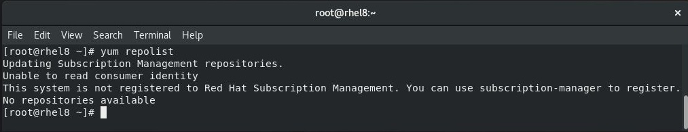

# Sizing

There are two kinds of people: those who make backups and those who will make them. But just doing  backups is not enough. To avoid unnecessary surprises, the best strategy is to plan your backup environment/procedure **before implementing** it. In this chapter we have gathered general tips and tutorials that you may find useful when thinking about implementing **KODO for Cloud**.

Many factors may affect your final deployment, but it's a good practice to answer following questions:

1. **What?**
   * What type of Microsoft 365 services you want to protect \(Exchange Online Mailbox, Calendars, Contacts, OneDrive\)? 
   * How big is the volume of your data? 
2. **Where?**
   * Where will you store your backups? Is it enough to use a simple \(or deduplicated\) dedicated filesystem \(separated from production environment\) or maybe you need more efficient backup destination.
3. **When?**
   * What is the best time to take backups? The most standard approach is to have backup window during the night \(for example 12 hours between 6:00 p.m. and 6:00 a.m.\). Depending on the volume of your data, you might consider adjusting it to suit your needs.

When you take the above questions into consideration you should have at least a good starting point to plan your backup strategy.


One Cloud Agent is capable to run 25 tasks in parallel. If you need to configure another Cloud Agent instance you will have to add additional 4GB of RAM and 2 cores to your system configuration.



When installing KODO for Cloud on RHEL 8 it is recomended to have active Red Hat subscription. Use **yum repolist** command to check it.


Based on the above, we prepared four configurations which are typical for most use cases.

