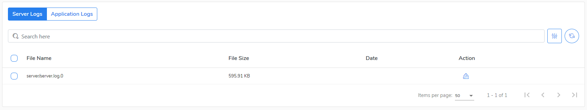
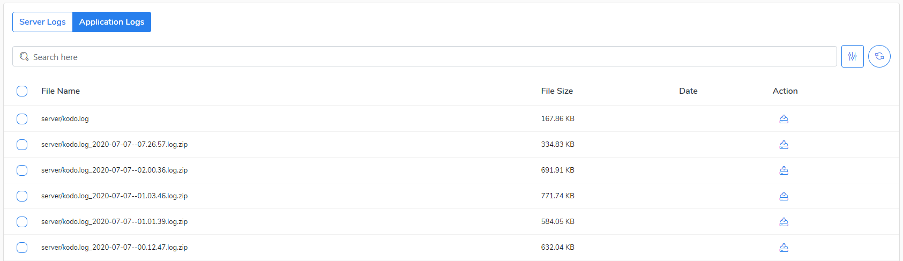

# Collecting logs

#### Getting access to the CloudAgent logs

CloudAgent logs contain information about backup and restore operation for Microsoft365. The default name for cloud agent instance is "**voyager**". You can add another instance of a cloud agent if your environment needs to be backed up in a more efficient way.    

To get logs for troubleshooting do the following:

1. Log in to the system where CloudAgent is installed.
2. Go to directory  `/opt/kodo-cloud/agent/logs/voyager`
3. Investigate the logs to look for a root cause of errors you've encountered.


If you install another CloudAgent on you Kodo for Cloud server, then the log's path will look as follow: `/opt/kodo-cloud/agent/logs/CloudAgent_name`


If necessary you can download logs using the SCP client of your choice \(i.e. WinSCP\).

Server logs are located at the following path:

`/opt/kodo-cloud/server/logs/server`

You can find two kinds of logs under that path:

* **Server logs** - \(`server.log.x`\)
* **Application logs** - \(kodo.log and `kodo_log.TIMESTAMP.log.zip`\) 

You can download logs from KODO for Cloud server by logging into WEB GUI as [**kodoadmin** ](../administration/organizations-kodoadmin-dashboard-only/settings/kodo-admin.md)user.

To get the logs do the following:

1. Log in to the KODO for Cloud server as **kodoadmin** user.
2. Go to the **Settings** menu.
3. At the **Settings** menu go to **Logs** tab.
4. Select **Server Logs** or **Application Logs** section.
5. Click **Download** to save selected log\(s\) file\(s\) locally or **Action** icon to save only one, chosen file.

