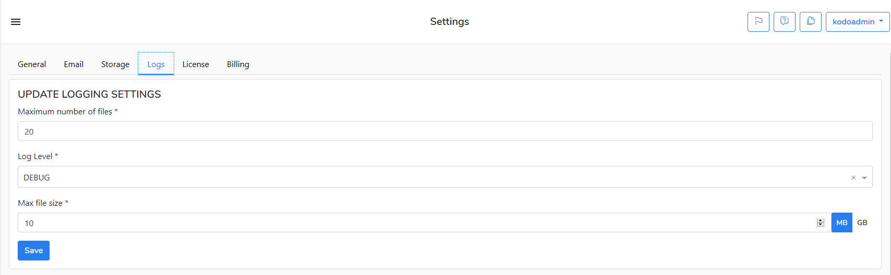

# How to change a log level in KODO for Cloud

If you need to change the default log level \(INFO\) and other settings for logging do as follow:

1. Log in to the KODO for Cloud server as **kodoadmin** user.
2. Go to the **Settings** menu.
3. At the **Settings** menu go to **Logs** tab.
4. Update logging settings by choosing a log level.
5. Click the **Save** button on finish.

You can set the following logging levels:

* INFO
* DEBUG
* TRACE

You can also set the maximum number of files and maximum log size \(in MB or GB\)

