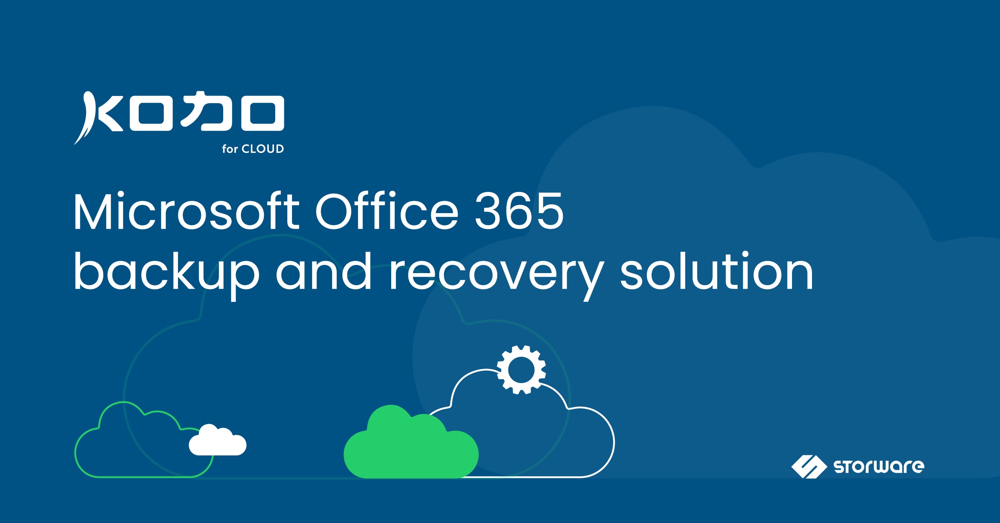

# KODO for Cloud documentation

This is the official documentation for KODO for Cloud software. Here you will find all the information needed to set up, configure, and manage backup for your cloud infrastructure.

## About KODO for Cloud

KODO for Cloud \(Microsoft 365\) is a comprehensive solution that allows you to back up and restore data of your Microsoft 365 services like Exchange Online, Exchange Online Archives, OneDrive for Business and SharePoint Online. It protects your business by performing daily backups to ensure business continuity and meet compliance demands. KODO for Cloud protects your critical data from loss due to ransomware, malware, other threats, or just simple user mistakes.

Thanks to the granular recovery feature and advanced search options available for backup data, you can choose to restore either entire mailboxes and site collections or only selected types of data – from email folders, calendars and contacts in Exchange Online or lists and libraries in SharePoint and OneDrive for Business, to individual items like single messages or file.

Protecting your organization with KODO for Cloud is easy and effective. KODO for Cloud provides granular data recovery and enables administrators to get the restore jobs done, reducing costs and meeting your organization's SLA like RPOs and RTOs.

## Intended Audience

This guide is intended for IT specialists who want to provide 24/7/365 data protection and availability for Microsoft 365 users.

